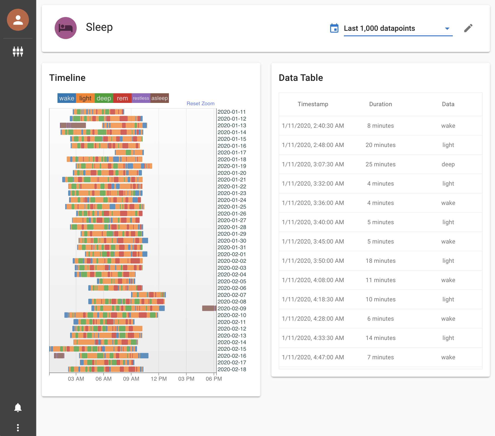
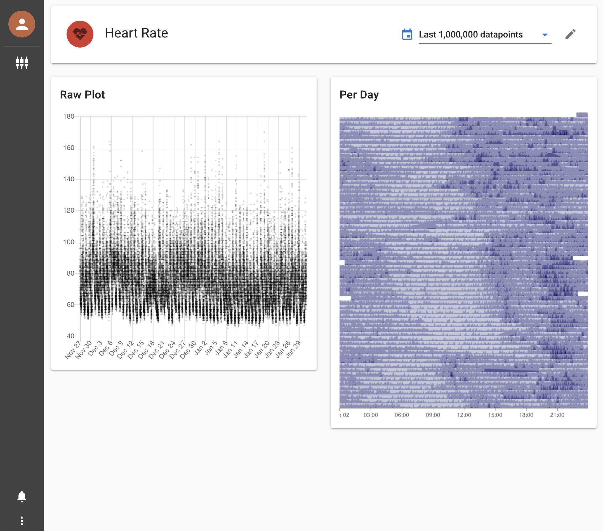

# Heedy Fitbit Integration

This plugin automatically syncs all of your Fitbit data with Heedy.

It guides you through setting up a fitbit app key, and handles all authentication for you.





### Supported fitbit data
**Available in this plugin**
- Steps
- Heart rate
- Sleep stages

**Missing but possible** (contributions welcome!)
- Activities
- Weight, body fat, BMI
- Food
- Resting heart rate (derivable from raw heart rate)
- Heart rate variability (derivable from raw heart rate)

**Currently not available in the Fitbit API** (status 05/2022)
- SpO2
- Skin temperature
- EDA
- Breathing rate

## Building

```
git clone https://github.com/heedy/heedy-fitbit-plugin
cd heedy-fitbit-plugin
make
```

The plugin zip file will be created at `dist/heedy-fitbit-plugin-{VERSION}.zip`. It can be installed by uploading to heedy from the UI.

### Developing

To develop the plugin, create a heedy database, run the build in debug mode (which watches files for changes and auto-updates them), and link the build to heedy's plugin directory:

```
heedy create testdb
mkdir testdb/plugins
make debug
# In a different terminal (since make debug watches files):
ln -s ${pwd}/dist/fitbit ./testdb/plugins/fitbit
```

At this point, you should edit `testdb/heedy.conf` to add the fitbit plugin. Any changes you make to the Python files require a heedy restart. 
