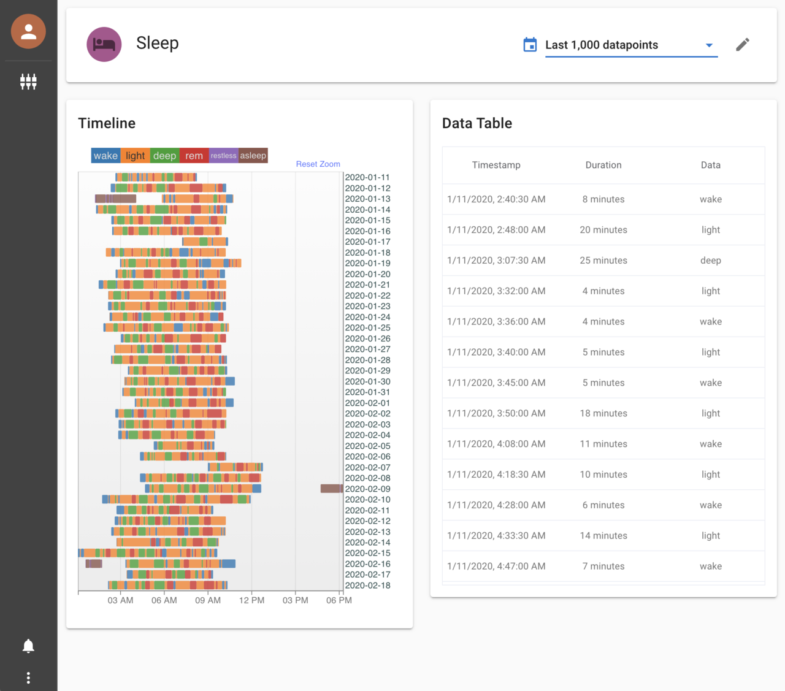

# Heedy Fitbit Integration

This plugin automatically downloads all of your Fitbit data into Heedy, and keeps it in sync. 

To install it, upload the release zip folder to heedy, and enable the resulting plugin. This will allow you to create a "fitbit" app, which will instruct you how to link your account.

